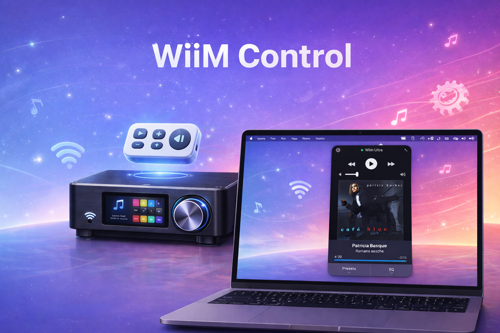
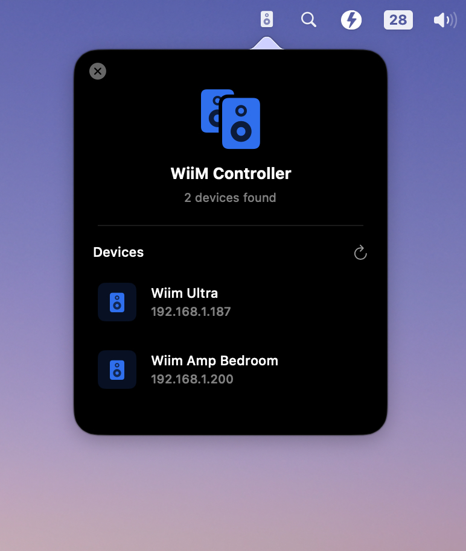
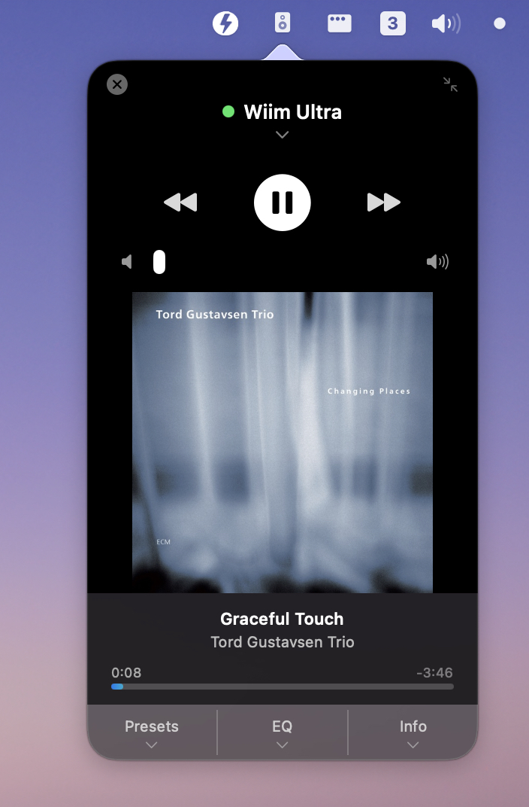
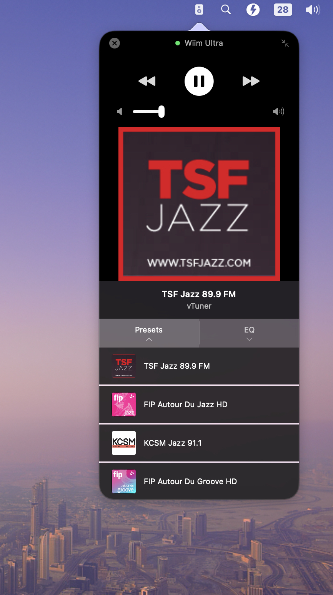
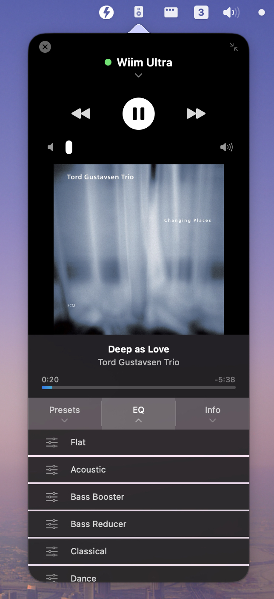
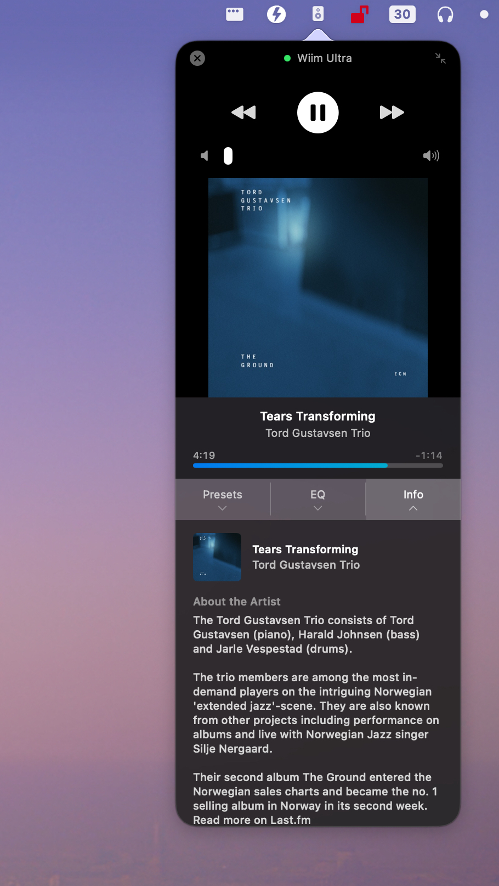
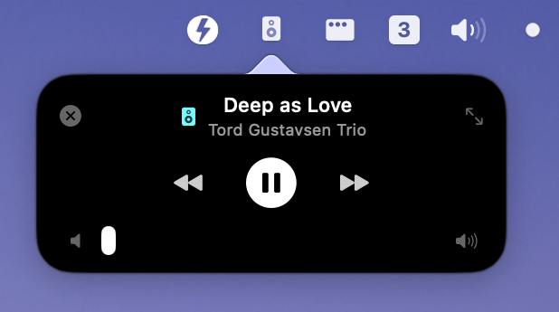

<p align="center">
  
</p>

# WiiM Control

A native macOS menu bar app for controlling WiiM audio devices.


## Features

- **Now Playing** - Album art, track info, and artist display
- **Playback Controls** - Play/pause, previous, next
- **Volume Control** - Slider with mute toggle
- **Seek Bar** - Track progress with drag-to-seek
- **Presets** - Quick access to saved radio stations with artwork
- **EQ Presets** - Switch between equalizer presets
- **Info Panel** - Artist bios and album details from Last.fm and Discogs
- **Mini Mode** - Compact view with essential controls
- **Auto Discovery** - Finds WiiM devices on your network automatically

## Installation

### Option 1: DMG (Recommended)
1. Download `WiiMControl.dmg` from [Releases](../../releases)
2. Open the DMG and drag `WiiMControl.app` to Applications
3. Right-click → Open (first launch only, to bypass Gatekeeper)

### Option 2: ZIP
1. Download `WiiMControl.zip` from [Releases](../../releases)
2. Unzip and drag `WiiMControl.app` to Applications
3. Right-click → Open (first launch only, to bypass Gatekeeper)

## User Guide

### Connecting to a Device

When you first launch the app, click the speaker icon in your menu bar to open the control panel.

<p align="center">
  
</p>

1. Your WiiM devices will appear automatically
2. Click on a device to connect to it

### Player Controls

<p align="center">
  
</p>

- **Play/Pause** - Large center button
- **Previous/Next** - Skip tracks
- **Volume** - Drag the slider or click the speaker icon to mute
- **Seek Bar** - Drag to jump to any position in the track

### Using Presets

Access your saved radio stations and playlists:

<p align="center">
  
</p>

1. Click on **Presets** at the bottom of the player
2. Click any preset to start playing
3. Preset artwork appears on the main display

### EQ Presets

Switch between equalizer presets:

<p align="center">
  
</p>

1. Click on **EQ** at the bottom of the player
2. Select an equalizer preset from the list
3. The current EQ is shown below the device name

### Info Panel

View artist biographies and album details:

<p align="center">
  
</p>

1. Click on **Info** at the bottom of the player
2. View artist bio from Last.fm
3. See album details and release info from Discogs
4. Info updates automatically when the track changes

### Mini Mode

Switch to a compact view with essential controls:

<p align="center">
  
</p>

1. Click the collapse button (↘) in the top-right corner
2. Mini mode shows track info, playback controls, and volume
3. Click the expand button (↗) to return to full mode

### Switching Devices

To disconnect or switch to a different device:

1. Click on the device name at the top of the player
2. You'll return to the device selection screen

### Quitting the App

Click the **X** button in the top-left corner of the panel.

## Requirements

- macOS 14.0 (Sonoma) or later
- WiiM device on the same local network

## Building from Source

```bash
git clone https://github.com/xon94010/WiiMControl.git
cd WiiMControl
open WiiMMenuBar.xcodeproj
```

### API Keys Setup

The Info panel features require API keys from Discogs and Last.fm. To enable these:

1. Copy the template: `cp Secrets.xcconfig.template Secrets.xcconfig`
2. Get your free API keys:
   - **Discogs**: https://www.discogs.com/settings/developers
   - **Last.fm**: https://www.last.fm/api/account/create
3. Edit `Secrets.xcconfig` and add your keys

The app works without these keys - the Info panel will just be disabled.

Build and run with ⌘R in Xcode.

## Project Structure

The codebase follows a modular architecture with views organized by functionality:

```
WiiMMenuBar/
├── WiiMMenuBarApp.swift        # App entry point
├── MenuBarView.swift           # Main routing (minimal)
├── WiiMService.swift           # Device communication
├── PlayerState.swift           # Player state management
├── DeviceDiscovery.swift       # Network device discovery
├── DiscogsService.swift        # Discogs API integration
├── LastFMService.swift         # Last.fm API integration
├── LaunchAtLogin.swift         # Login item helper
└── Views/
    ├── Player/
    │   ├── FullModeView.swift      # Full player UI
    │   ├── MiniModeView.swift      # Compact player UI
    │   ├── PlaybackControls.swift  # Play/pause/skip buttons
    │   ├── VolumeControl.swift     # Volume slider + mute
    │   ├── SeekBar.swift           # Progress bar with seeking
    │   └── AlbumArtView.swift      # Album artwork display
    ├── Tabs/
    │   ├── BottomTabsSection.swift # Presets/EQ/Info tabs
    │   ├── InfoPanelView.swift     # Artist & album info
    │   ├── PresetRowView.swift     # Preset list item
    │   └── EQRowView.swift         # EQ preset item
    └── Setup/
        ├── SetupView.swift         # Device discovery screen
        └── DeviceRow.swift         # Device list item
```

## Troubleshooting

**Device not found?**
- Ensure your Mac and WiiM are on the same network
- Click the refresh button to scan again
- Check that your firewall allows local network access

**Album art not loading?**
- Album art is fetched from iTunes for music tracks
- Radio station artwork comes from the preset configuration

**Controls not responding?**
- Check the connection indicator (green dot = connected)
- Try disconnecting and reconnecting

## License

MIT License - see [LICENSE](LICENSE) for details.

## Credits

Built with SwiftUI for macOS.

- Album art powered by iTunes Search API
- Artist bios powered by [Last.fm](https://www.last.fm/)
- Album details powered by [Discogs](https://www.discogs.com/)
